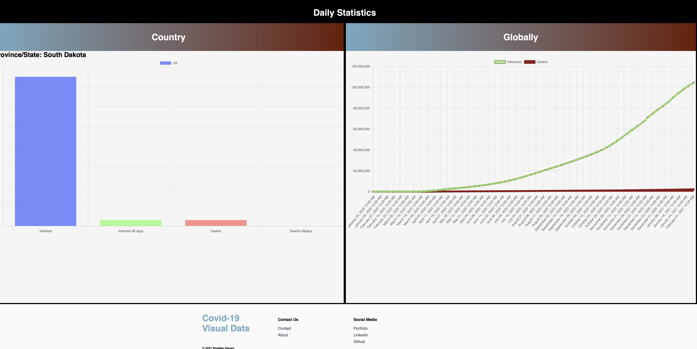

<h1 align="center">COVID-19 Data Visualized</h1>

Hello, My name is Bradley! This website originated from a simple react
        graph project I made over the summer. I wanted to develop a visually
        appealing website that pulled current COVID-19 data and displayed the
        information with easy charts. My main two goals for this project were to
        use GatsbyJs with graphql to query and display data and style the
        website with react-styled components. I wanted to start with a blank
        slate project that gave me one hundred percent customization. The
        biggest takeaways I learned from this project are that GatsbyJs and
        graphql provide an easy and fast way to build a static website. Styled
        components provided me with an easy way to quickly create any react
        component or style. I had a lot of fun learning GatsbyJs and all it
        brings to your website, the final product isn't complete nor perfect and
        I do want to revisit this site in the future to add more and clean up
        some styling issues. Lastly the site is deployed on netlify, which I can
        say was easy and intuitive with my gatsby project.

## Links

- [Repo](https://github.com/BradleyGenao/react-gatsby-covid-charts "Repo")

- [Live](https://covid-tracker-genao.netlify.app "Live View")

- [Bugs](https://github.com/BradleyGenao/react-gatsby-covid-charts/issues "Issues Page")

- [API](https://covid19.mathdro.id/api "API")

## Screenshots

## Available Commands

In the project directory, you can run:

### `gatsby start" : "npm start"`,

The app is built using `init gatsby` so this command Runs the app in Development mode. Open [http://localhost:8000](http://localhost:3000) to view it in the browser. The page will reload if you make edits.
You will also see any lint errors in the console.

### `"gatsby build": "npm run build"`,

Builds the app for production to the `build` folder. It correctly bundles Gatsby in production mode and optimizes the build for the best performance. The build is minified and the filenames include the hashes. Your app will be ready to deploy!

## Built With

- JavaScript
- Gatsby
- Graphql
- NPM
- Webpack
- HTML
- React Styled Components

## Future Updates

- [ ] Clean up styling and layout
- [ ] Add vaccine data

## Author

**Bradley Genao**

- [Profile](https://github.com/BradleyGenao "Bradley Genao")
- [Email](mailto:bradley@genao.io?subject=Hello "Hi! my name is")
- [Website](https://genao.io "Welcome")

## 🤝 Support

Contributions, issues, and feature requests are welcome!

Give a ⭐️ if you like this project!

